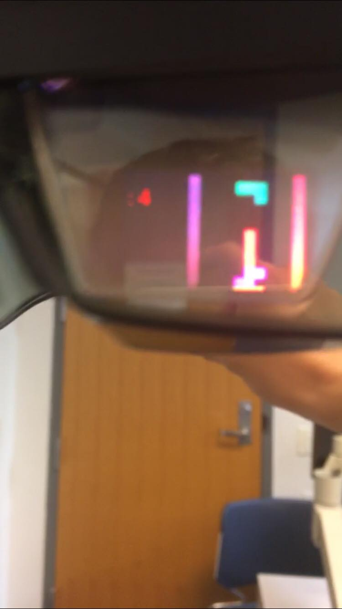

# AR_Tetris
This is a AR tetris game controlled by hand gestures.

## demo

### Controlled with index finger and thumb
-Tapping fingers together then releasing changes the orientation of tetris pieces
-Tapping fingers together then holding to move tetris pieces left/right.
